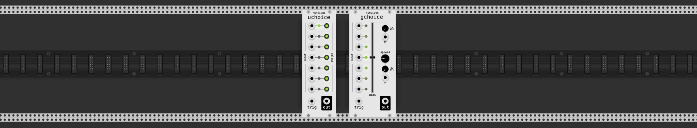
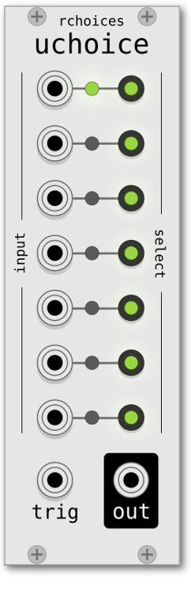
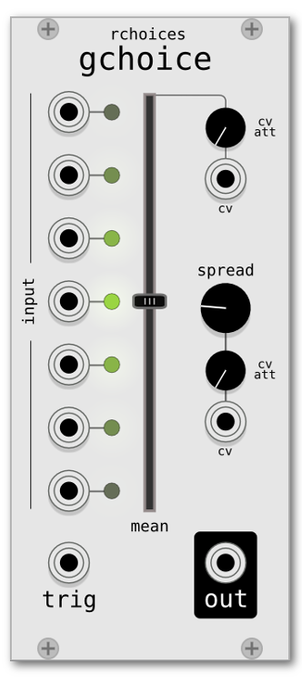
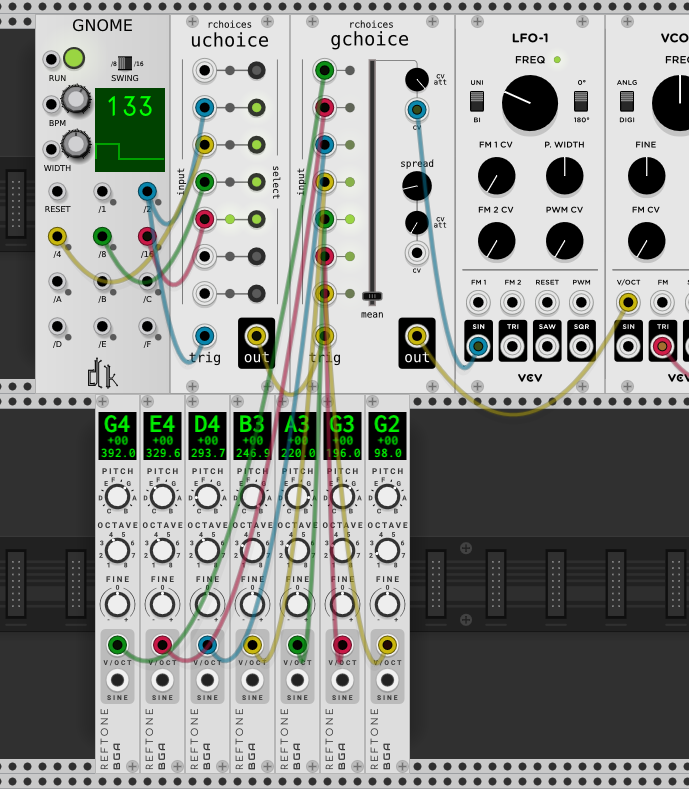

# rchoices --- random choice modules for VCV Rack

    

This plugin currently contains two modules, uchoice and gchoice. Each module has seven inputs. One randomly chosen input gets routed to the output.
A signal on the `trig`-input causes a new choice.

## uchoice --- random uniform choice

    

Chooses one of the inputs following a uniform distribution.
You can exclude inputs by disabling them with the green buttons. The current choice is highlighted with a green LED.

## gchoice --- random gaussian choice

    

Chooses one of the inputs following a gaussian distribution.
The brightness of the LEDs right to each input is proportional to the probability of that input being chosen. The current choice is highlighted at full brightness.

Parameters and additional inputs:
 - `mean`: the center of the distribution
 - `mean cv`: control voltage for `mean` (0V - 10V)
 - `mean cv att`: attenuator for `mean cv`. The value of mean is `mean + attenuator * cv`
 - `spread`: the width of the distribution
 - `spread cv`: control voltage for `spread` (0V - 10V)
 - `spread cv att`: attenuator for `spread cv`. The value of mean is `spread + attenuator * cv`

<!-- ---

    

 -->
